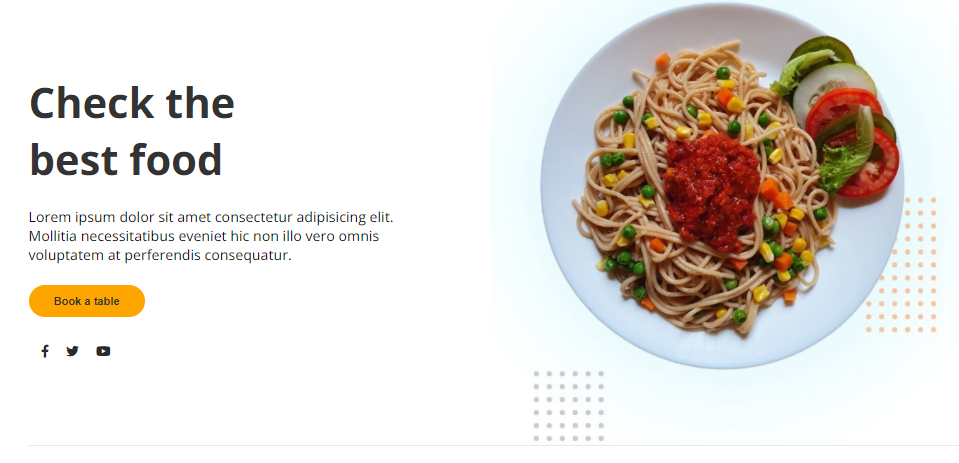
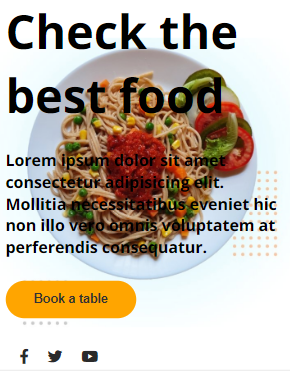

 

# The Kitchen

I'm practicing css grid and I made this small project for a kitchen.

> Project

### Made with 🔨

 

### Project view

<a href="https://pixe-l.github.io/Kitchen-Css-Grid/">Take a look at the page.</a>

Project carried out thanks to Platzi courses.

